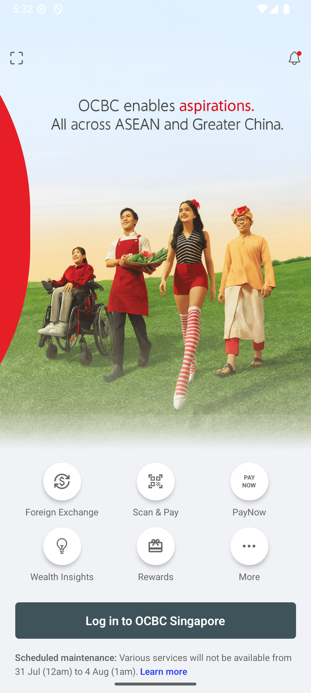
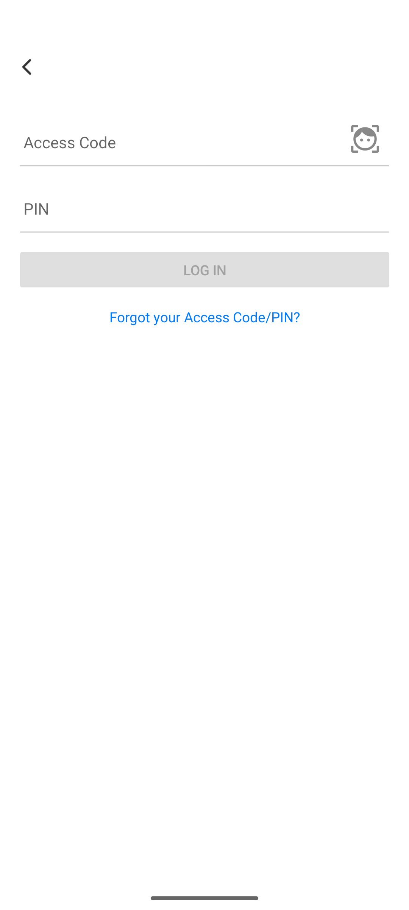

# 🛑 Fake Banking App Security Demo – OCBC UI Clone

This project demonstrates the **real-world threat of sideloaded Android apps** that impersonate trusted applications — in this case, a **simulated OCBC Banking App clone**.

It shows how a malicious actor can:

- **Decompile legit applications**
- **Tamper with its backend endpoints**
- **Re-sign and distribute the app**
- **Harvest sensitive user data** (e.g., login credentials) from unsuspecting users

---

## 📸 App Screenshots

<div style="display: flex; justify-content: center; align-items: flex-start;">
  <div style="flex: none; text-align: center;">
    <strong>Home Page</strong><br/>
    
  </div>
  <div style="flex: none; margin-left: -4px; text-align: center;">
    <strong>Login Page</strong><br/>
    
  </div>
</div>


---

## 📱 App Overview

This project starts with a **mock version of the OCBC mobile app**, replicating its **home page** and **login page** UI.

Originally, the app was configured to send login credentials to a **`legitOcbc` endpoint**, simulating a legitimate backend.

However, for the purpose of this demo:

- The backend URL is **tampered** and replaced with an **attacker-controlled endpoint**
- The APK is **recompiled and re-signed** to make it appear legitimate
- When victims sideload and launch the app, their credentials are unknowingly sent to the attacker's server

This demonstrates how **phishing via visually convincing sideloaded apps** can compromise sensitive user information like banking credentials.


---

## 🔍 Vulnerability Demonstrated

1. **APK Decompilation** – Mobile apps can be reverse engineered using tools like `apktool`
2. **Code & Endpoint Modification** – Changing the target API endpoint to a malicious server
3. **Repackaging & Re-signing** – Creating a new, installable APK that appears legitimate
4. **Phishing via Sideloading** – Distributing the fake app to unsuspecting victims who think it’s the official app

---

## 🛠️ Demo Steps

### 1️⃣ Decompile the APK
```bash
apktool d ocbcClone.apk -o ocbcClone_decomp
```

### 2️⃣ Search for Targeted Database References
```bash
grep -r "legitOcbc" ocbcClone_decomp
```

### 3️⃣ Modify Endpoint
Edit the discovered code/config to replace the legitimate OCBC API URL with the attacker-controlled endpoint.


### 4️⃣ Rebuild the Modified APK
```bash
apktool b ocbcClone_decomp -o attacker-app.apk
```

### 5️⃣ Re-sign the APK
```bash
$ANDROID_SDK_ROOT/build-tools/35.0.0/apksigner sign \
  --ks /Users/nictjh/Environment/CSA/tok/FakeApp/ocbcClone/android/app/debug.keystore \
  --ks-key-alias androiddebugkey \
  --ks-pass pass:android \
  --key-pass pass:android \
  --out attacker-app-signed.apk \
  attacker-app.apk
```

### 6️⃣ Install the APK on Device
```bash
adb install -r attacker-app-signed.apk
```

---

## 🧪 Demo Behavior

- **Victim perspective:**
  Sees what appears to be the real OCBC mobile app.
  - Can “log in” using their real credentials.
  - Does not suspect the app is fake due to familiar branding and UI.

- **Attacker perspective:**
  Captures credentials in their own database via the modified endpoint.

---

## 🎯 Goal of the Demo

To highlight **why sideloading unknown APKs is dangerous**, even if they “look” like legitimate apps.

Key security takeaways:

- Always install apps from trusted sources (e.g., Google Play, Apple App Store)
- Code signing and integrity checks help detect tampering
- Avoid hardcoding sensitive API endpoints in mobile apps
- Use server-side validation and monitoring for unusual activity

---

## 🧪 Tested Environment

| Property             | Value                |
|----------------------|---------------------|
| Android Version      | 16.0 (API 36, Baklava)   |
| Emulator             | Android Studio AVD  |
| Device Architecture  | arm64-v8a           |

---

## 🛡️ Security Lesson

**A cloned app can be indistinguishable from the real one** to an untrained user.  
The best defense is **digital signature verification, secure app distribution channels, and user awareness**.
